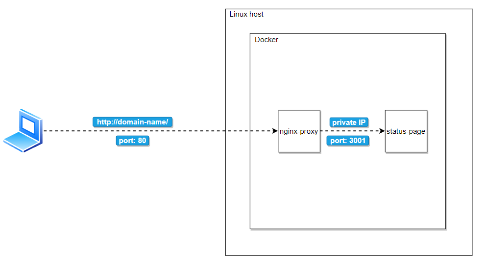

# Zadanie ADSK - Dominik Borowy

## Ansible - Wordpress
Zadanie: https://e-uczelnia.uek.krakow.pl/mod/assign/view.php?id=738743

Ansible playbook tego zdania znajduję się w pliku *wordpress-playbook.yml*

- Uruchomienie

- Wynik

## Ansible - Status-page + proxy
Zadanie: https://e-uczelnia.uek.krakow.pl/mod/assign/view.php?id=738744

Ansible playbook tego zdania znajduję się w pliku *status-page-playbook.yml*

Playbook instaluje Dockera i następnie wystawia skonteneryzowane wersje serwera proxy oraz prostego status-page'a. 
Proxy przekierowuje zapytania z portu 80 i domeny podanej jako zmienna *status_host* w pliku *vars/default.yml* na port 3001 kontenera status-page.

- Uruchomienie

- Wynik

- Infrastruktura sieciowa w ramach której działa usługa proxy i aplikacja
